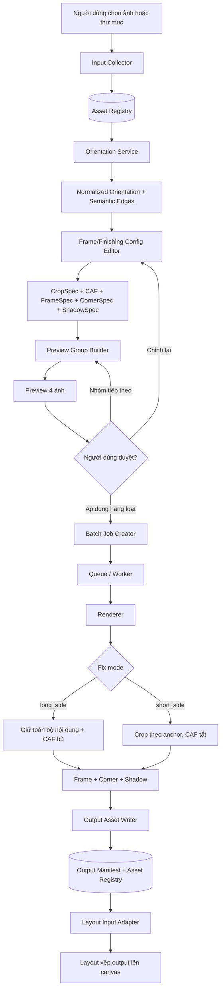
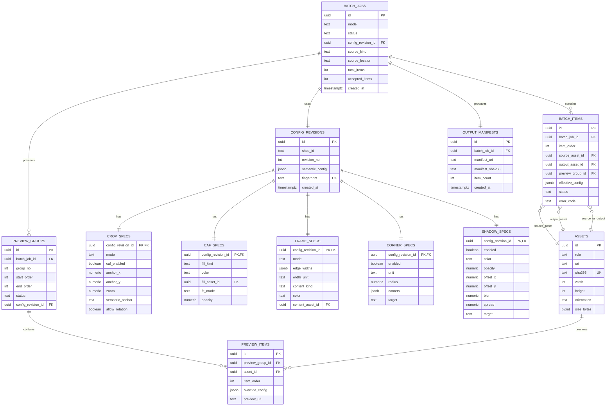

# Frame/Finishing: Data Flow và cấu trúc dữ liệu

## 1. Phạm vi

Tài liệu này mô tả luồng dữ liệu và mô hình lưu trữ cho Shop Frame/Finishing. Shop nhận một ảnh hoặc một thư mục ảnh, chuẩn hóa orientation, áp dụng `CropSpec`, chế độ CAF, `FrameSpec`, `CornerSpec` và `ShadowSpec`, cho phép preview theo nhóm bốn ảnh, rồi tạo batch output để Layout tiếp nhận.

Layout không lưu hay điều khiển crop của từng ảnh. Shop Frame/Finishing lưu cấu hình và manifest; file ảnh lớn được lưu trong filesystem/object storage, còn cơ sở dữ liệu chỉ lưu metadata, fingerprint và liên kết tài nguyên.

## 2. Nguyên tắc dữ liệu

| Nguyên tắc | Quy tắc |
|---|---|
| Cấu hình tái hiện được | Mọi batch phải tham chiếu một phiên bản cấu hình bất biến |
| Không trộn input và output | Asset nguồn, preview và output có trạng thái riêng |
| Orientation trước fitting | `top/bottom/left/right` được tính sau khi chuẩn hóa hướng ảnh |
| Fix theo cạnh dài | Giữ nội dung, CAF bật để bù phần thiếu |
| Fix theo cạnh ngắn | Crop chủ đích, CAF tắt, lưu anchor/offset |
| Batch-first | Một cấu hình mặc định cho batch; override chỉ ở nhóm hoặc ảnh khi cần |
| Content-addressed | Asset và output có SHA-256 để chống trùng và truy vết |

## 3. Data Flow tổng thể



## 4. Luồng xử lý chi tiết

### 4.1. Nạp input và chuẩn hóa orientation

`Input Collector` quét file đơn hoặc thư mục, lọc phần mở rộng được phép và tạo thứ tự ổn định. Mỗi file được đăng ký trong `assets`. `Orientation Service` đọc EXIF và chuẩn hóa hướng hiển thị, đồng thời trả về semantic edges. Cạnh `bottom` sau bước này là cạnh đáy theo nội dung ảnh, không phải nhất thiết là cạnh dưới của bitmap thô.

### 4.2. Tạo cấu hình

Người dùng tạo một `config_revision` chứa `CropSpec`, `CAFSpec`, `FrameSpec`, `CornerSpec`, `ShadowSpec` và chính sách orientation. Cấu hình không bị sửa tại chỗ sau khi batch bắt đầu; thay đổi mới tạo revision mới để có thể tái hiện kết quả cũ.

### 4.3. Preview theo nhóm bốn ảnh

`preview_groups` chia danh sách input thành các nhóm tối đa bốn asset. Mỗi nhóm có thể có trạng thái `PENDING`, `PREVIEWED`, `ACCEPTED` hoặc `NEEDS_REVIEW`. Preview lưu snapshot cấu hình và kết quả render tạm thời. Người dùng có thể chuyển nhóm trước/sau hoặc bấm `Áp dụng hàng loạt` để tạo batch job từ revision đang được chấp nhận.

### 4.4. Fitting và CAF

Với `long_side`, renderer giữ toàn bộ nội dung ảnh, scale theo cạnh dài và chuyển phần thiếu cho CAF. CAF có thể dùng màu, ảnh, texture hoặc trong suốt.

Với `short_side`, renderer scale để lấp đầy khung, tắt CAF và crop phần thừa. Người dùng kéo ảnh trong preview để chọn vùng giữ lại. Vị trí lưu dưới dạng `anchor_x`, `anchor_y`, `zoom` chuẩn hóa thay vì tọa độ pixel tuyệt đối.

### 4.5. Render và bàn giao Layout

Worker render output, tính SHA-256, ghi asset output và cập nhật `batch_items`. `output_manifests` ghi thứ tự, đường dẫn, kích thước, orientation, cấu hình và hash. Layout chỉ đọc danh sách output theo `order` qua `Layout Input Adapter`.

## 5. Mô hình quan hệ



## 6. Schema SQL đề xuất

Schema dưới đây dùng PostgreSQL. Nếu ứng dụng hiện chạy SQLite cục bộ, các kiểu `uuid`, `jsonb` và `timestamptz` có thể ánh xạ sang text/json/integer trong adapter; contract nghiệp vụ vẫn giữ nguyên.

```sql
create table assets (
    id uuid primary key,
    role text not null check (role in ('source', 'preview', 'output', 'frame_content', 'caf_fill')),
    uri text not null,
    sha256 char(64) not null,
    size_bytes bigint,
    width integer,
    height integer,
    orientation text,
    mime_type text,
    created_at timestamptz not null default now(),
    unique (sha256)
);

create table config_revisions (
    id uuid primary key,
    shop_id text not null,
    revision_no integer not null,
    semantic_config jsonb not null,
    fingerprint char(64) not null,
    created_at timestamptz not null default now(),
    unique (shop_id, revision_no),
    unique (shop_id, fingerprint)
);

create table crop_specs (
    config_revision_id uuid primary key references config_revisions(id) on delete cascade,
    mode text not null check (mode in ('long_side', 'short_side', 'auto', 'preserve')),
    caf_enabled boolean not null,
    anchor_x numeric(8,6) not null default 0.5 check (anchor_x between 0 and 1),
    anchor_y numeric(8,6) not null default 0.5 check (anchor_y between 0 and 1),
    zoom numeric(8,4) not null default 1.0 check (zoom > 0),
    semantic_anchor text not null default 'center',
    allow_rotation boolean not null default true
);

create table caf_specs (
    config_revision_id uuid primary key references config_revisions(id) on delete cascade,
    fill_kind text not null check (fill_kind in ('solid', 'image', 'texture', 'transparent')),
    color char(6),
    fill_asset_id uuid references assets(id),
    fit_mode text not null default 'cover' check (fit_mode in ('cover', 'contain', 'stretch', 'tile')),
    opacity numeric(5,4) not null default 1.0 check (opacity between 0 and 1)
);

create table frame_specs (
    config_revision_id uuid primary key references config_revisions(id) on delete cascade,
    mode text not null check (mode in ('legacy', 'inside', 'polaroid', 'image_frame')),
    width_unit text not null check (width_unit in ('px', 'mm', 'cm', 'percent')),
    edge_widths jsonb not null,
    content_kind text not null check (content_kind in ('solid', 'image', 'texture', 'transparent')),
    color char(6),
    content_asset_id uuid references assets(id)
);

create table corner_specs (
    config_revision_id uuid primary key references config_revisions(id) on delete cascade,
    enabled boolean not null default false,
    unit text not null check (unit in ('px', 'mm', 'cm', 'percent')),
    radius numeric(10,4) not null default 0 check (radius >= 0),
    corners jsonb not null default '{"top_left":true,"top_right":true,"bottom_left":true,"bottom_right":true}',
    target text not null check (target in ('image', 'frame', 'output'))
);

create table shadow_specs (
    config_revision_id uuid primary key references config_revisions(id) on delete cascade,
    enabled boolean not null default false,
    color char(6) not null default '000000',
    opacity numeric(5,4) not null default 0.28 check (opacity between 0 and 1),
    offset_x numeric(10,4) not null default 0,
    offset_y numeric(10,4) not null default 0,
    blur numeric(10,4) not null default 0,
    spread numeric(10,4) not null default 0,
    target text not null check (target in ('frame', 'image', 'output'))
);

create table batch_jobs (
    id uuid primary key,
    mode text not null check (mode in ('single', 'folder_batch')),
    status text not null check (status in ('draft', 'previewing', 'queued', 'running', 'paused', 'completed', 'failed', 'cancelled')),
    config_revision_id uuid not null references config_revisions(id),
    source_kind text not null check (source_kind in ('file', 'folder')),
    source_locator text not null,
    ordering text not null default 'natural_filename',
    total_items integer not null default 0,
    accepted_items integer not null default 0,
    created_at timestamptz not null default now(),
    started_at timestamptz,
    completed_at timestamptz
);

create table preview_groups (
    id uuid primary key,
    batch_job_id uuid not null references batch_jobs(id) on delete cascade,
    config_revision_id uuid not null references config_revisions(id),
    group_no integer not null,
    start_order integer not null,
    end_order integer not null,
    status text not null check (status in ('pending', 'previewed', 'accepted', 'needs_review')),
    unique (batch_job_id, group_no)
);

create table preview_items (
    id uuid primary key,
    preview_group_id uuid not null references preview_groups(id) on delete cascade,
    asset_id uuid not null references assets(id),
    item_order integer not null,
    override_config jsonb,
    preview_uri text,
    unique (preview_group_id, item_order)
);

create table batch_items (
    id uuid primary key,
    batch_job_id uuid not null references batch_jobs(id) on delete cascade,
    item_order integer not null,
    source_asset_id uuid not null references assets(id),
    output_asset_id uuid references assets(id),
    preview_group_id uuid references preview_groups(id),
    effective_config jsonb not null,
    status text not null check (status in ('pending', 'previewed', 'queued', 'processing', 'completed', 'failed', 'skipped')),
    error_code text,
    unique (batch_job_id, item_order)
);

create table output_manifests (
    id uuid primary key,
    batch_job_id uuid not null unique references batch_jobs(id) on delete cascade,
    manifest_uri text not null,
    manifest_sha256 char(64) not null,
    item_count integer not null,
    created_at timestamptz not null default now()
);

create index idx_assets_sha256 on assets(sha256);
create index idx_batch_jobs_status on batch_jobs(status);
create index idx_batch_items_job_status on batch_items(batch_job_id, status);
create index idx_preview_groups_job_order on preview_groups(batch_job_id, group_no);
```

## 7. Versioning và override

`config_revisions` là immutable sau khi batch chuyển sang `queued`. Khi người dùng sửa crop anchor, zoom, CAF hoặc frame, hệ tạo revision mới. Điều này bảo đảm output cũ vẫn tái hiện được.

Batch dùng `config_revision_id` làm cấu hình mặc định. `preview_items.override_config` chỉ cần có khi một nhóm bốn ảnh khác cấu hình mặc định. Khi worker bắt đầu, hệ hợp nhất cấu hình theo thứ tự:

```text
Shop default
  → batch config revision
  → preview group override
  → item override nếu được cho phép
```

Để tránh phình dữ liệu, không nhân bản toàn bộ cấu hình ở mọi dòng. `effective_config` trong `batch_items` chỉ nên là snapshot JSON tối giản phục vụ tái hiện và audit; cấu hình chuẩn vẫn nằm ở `config_revisions`.

## 8. Transaction và trạng thái batch

Khi bấm `Áp dụng hàng loạt`, hệ nên thực hiện một transaction tạo `batch_jobs`, `preview_groups` và `batch_items`. Worker chỉ nhận batch ở trạng thái `queued`. Mỗi item cập nhật trạng thái độc lập để có thể retry mà không chạy lại toàn bộ batch.

Khi output ghi thành công, hệ ghi asset với SHA-256 trước, sau đó cập nhật `batch_items.output_asset_id`. Chỉ khi tất cả item bắt buộc hoàn tất mới tạo `output_manifests` và chuyển batch sang `completed`. Nếu có item lỗi, batch chuyển `failed` hoặc `completed_with_errors` tùy policy.

## 9. Chỉ mục và chống trùng

Các chỉ mục quan trọng là `assets.sha256` để tái sử dụng file đã có, `(batch_job_id, item_order)` để giữ thứ tự, `(batch_job_id, group_no)` để điều hướng preview bốn ảnh và `(shop_id, fingerprint)` để không tạo revision cấu hình trùng nội dung.

## 10. Điểm nối với Layout

Layout chỉ cần một adapter đọc manifest:

```json
{
  "collection_id": "...",
  "items": [
    {
      "order": 1,
      "output_uri": "...",
      "width": 1200,
      "height": 1800,
      "sha256": "..."
    }
  ]
}
```

Layout không cần truy vấn `crop_specs`, `caf_specs` hoặc `preview_groups`. Các bảng này thuộc lifecycle của Shop Frame/Finishing. Điều này giữ Layout gốc nhẹ và bảo vệ compatibility.

## 11. Kết luận

Mô hình đề xuất tách rõ bốn lớp: asset registry, immutable configuration revisions, preview/batch orchestration và output manifest. `CropSpec` biểu diễn fit/crop/anchor; `CAFSpec` biểu diễn cách bù phần thiếu; `FrameSpec`, `CornerSpec` và `ShadowSpec` biểu diễn hoàn thiện khung; `BatchJob` và `PreviewGroup` điều phối việc duyệt bốn ảnh và áp dụng hàng loạt.

Thiết kế này cho phép mở rộng từ viền màu sang inner border, Polaroid, image frame, shadow và crop tương tác mà không đưa logic batch hoặc chỉnh từng ảnh vào Layout Shop.

## References

Không sử dụng nguồn bên ngoài; đây là thiết kế kiến trúc nội bộ dựa trên các yêu cầu nghiệp vụ đã chốt cho Shop Frame/Finishing.

*Author: Manus AI*
